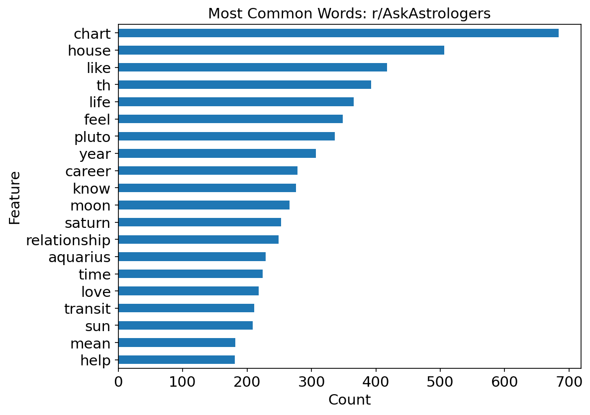
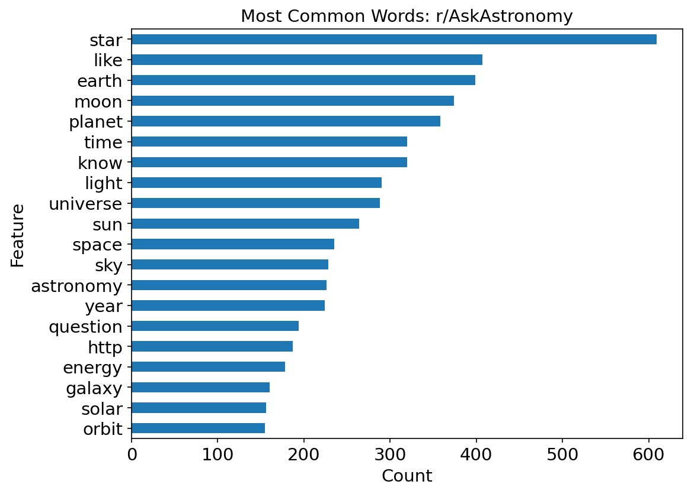
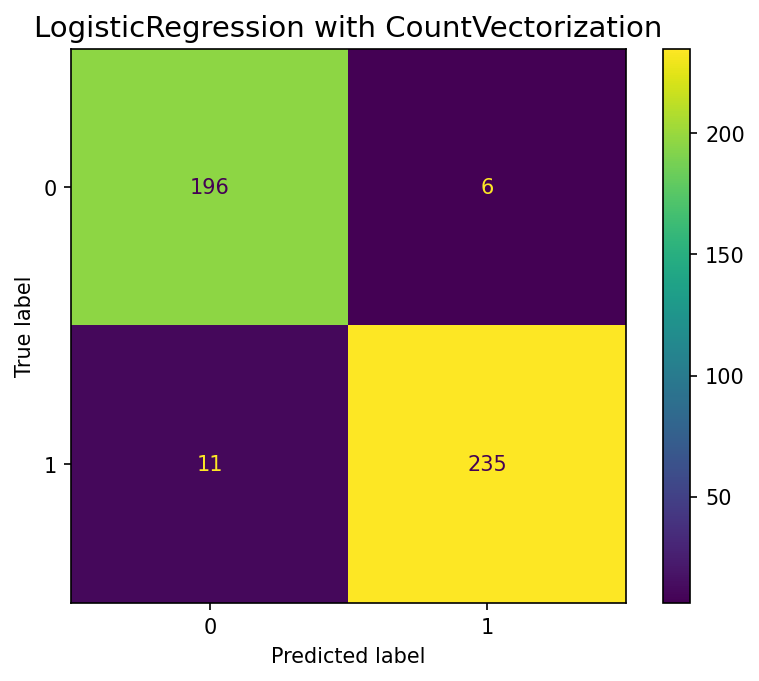
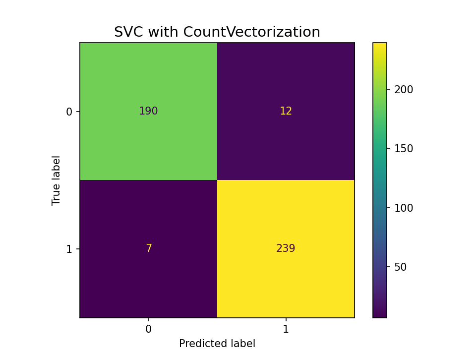

# Astronomy vs Astrology: Classification of Language on Posts in r/AskAstronomy and r/AskAstrologers

## Structure

1. [Data_Collection](code/01_Data_collection.ipynb)
2. [EDA and Data Cleaning](code/02_EDA_Cleaning.ipynb)
3. [Modeling and Evaluation](code/03_Modeling.ipynb)

## Problem Statement

It is common for many to confuse the terms `astronomy` and `astrology` and likely much of their percieved meanings. Distinctions like this are important as related to how people generally distinguish between science and pseudoscience. We investigate how people talk or more specifically how they ask questions about astronomy and astrology using NLP of text data from the [r/AskAstronomy](https://www.reddit.com/r/askastronomy/) and [r/AskAstrologers](https://www.reddit.com/r/askastrologers/) subreddits and producing classification models. Respectivally these subreddits have 54,000 users (top 2%) and 147,000 users (top 1%). 

## Data Collection

Data was scraped using PRAW from the subreddits r/AskAstrologers and r/AskAstronomy from multiple days acquired from 1/27/2024 to 1/30/2024, with only $\sim100$ new entries per day. In total this webscraping yielded $\simeq 2200$ unique entries. Using PRAW and custom Python funtions the data was translated to `DataFrame` with columns: `created_utc`, `name`, `title`, `selftext`, `subreddit` and saved as csv files.

## Data Cleaning and EDA 

1. The raw data spanning multiple files were merged into a single `DataFrame` and duplicates were dropped. 
2. The `selftext` column contained many missing entries. We treated these missing values by merging the `title` and `selftext` columns into a single `post` column (concatenating them). This also gave us larger sample size to work with.
3. The `post` column was cleaned using NLP methods: converting to text with `BeauttifulSoup`, removing apostrophes and any non-letter characters with Regex, and lemmatizing with `WordNetLemmatizer` from `nltk`. 

Examples of cleaned posts are given in the table below:

| `name` |`created_utc`  | `post`  | `subreddit` | 
| --- | --- | --- | ---  | 
| `t3_1acb51z` |2024-01-27 13:44:52 | master ece join college soon india right available option electrical engineering want make career astrophysics go master usa possible master electrical electronic engineering | askastronomy |
| `t3_1ac65td` |2024-01-27 08:21:38 | plane stellar planetary system oriented parallel milky way generally tilted | askastronomy |
| `t3_1absdye` |2024-01-26 20:42:56 | brightness magnitude solar eclipse asking search magnitude eclipse return page much coverage moon sun approximate brightness solar eclipse purchased new lens prior experience photographing eclipse turned exposed experiment moon phase would somewhat similar would see eclipse thanks guidance advance | askastronomy |
| `t3_1abncxc` |2024-01-26 17:09:56 | derivative position defines freefall always thought never really made sense define acceleration due gravity set distance source gravity since acceleration change based distance freefall time derivative position exactly would someone solve say position travelled integral km earth straight freefall could iterated integration really used define something would normal function acceleration jerk familiar mathematics beyond multivariable calculus know aspect differential modeling | askastronomy |
| `t3_1abcko8` |2024-01-26 07:11:24 | uranus truly impressive colour difference image extremely saturated plant different blue white coloured cloud | askastronomy |
| `t3_1acjmvr` |2024-01-27 20:06:07 | feb terrible past relationship could reason new possibility getting long term relationship anytime soon thank please explain layman language new | askastrologers |
| `t3_1acjm0x` |2024-01-27 20:05:05 | terrifying seemingly bang second opinion virgo sun scorpio moon sag ascendence gone tumultuous ending relationship last year facing heat work six month spoke first time ever mostly needed reading around work growth health relationship reading seemed alignment high low life looked far pointed something nothing come easy take lot failure reach goal accurate anyone gauged life eventually took three attempt fully open tell never seen tumultuous chart everything seems getting affected reason despite best effort chart apparently show lot struggle result late predicted success relationship miscarriage attempt child want kid definitely slow growth career tough work week passed honestly listening anyone want read offer word hopefully strangest chart seen | askastrologers |
| `t3_1acjgy6` |2024-01-27 19:59:11 | pluto aquarius affect sorry frequent question aquarius placement kinda concerned interpretation extra information welcome well | askastrologers |
| `t3_1acjd62` |2024-01-27 19:54:33 | time pleasure trip birthday yearly sun chart ruler transit | askastrologers |
| `t3_1acjb0u` |2024-01-27 19:51:56 | advice compatibility love reading impression | askastrologers |

4. `CountVectorizer` was used to explore common words (see plots below) and remove meaningless words that were common to both subreddits. The most common words are shown in the bar graphs below for each subreddit. 

 

5. The cleaned `DataFrame` was saved to a csv file [data_cleaned_askastrologers_askastronomy.csv](data/data_cleaned_askastrologers_askastronomy.csv). It's described in the data dictionary below.

### Data Dictionary:

  Column     |  Dtype  | Description       
|:------------|:---------------|----|
| `name` | `object` | Unique identifier of post.
| `created_utc` | `datetime64[ns]` | UTC in YYYY-MM-DD HH:MM:SS format.
| `post`        | `object`         | Column representing combined `title` and `selftext` from subreddit posts processed and cleaned through NLP. 
| `subreddit`   | `object`         | Subreddit label (`askastrologers` or `askastronomy`).

                                                                                                               

## Preprocessing and Modeling

### Baseline Accuracy

The baseline accuracy, which is the proportion of target `askastrologers` in the data, is 54%. 

                                                                                                               
### Model Selection and Evaluation

1. We first define the feature matrix as the post column and the target vector as the subreddit column mapped to 1 for `askastrologers` and 0 for `askastronomy`. 
2. Train/test split to 0.8/0.2 of the data, stratifying on y.
3. Set up `Pipeline`s and parameters for `GridSearchCV` to train `LogisticRegression` and `SVC` models and find the optimal set of hypterparameters. 
4. The first step step of the pipeline is to vectorize the text data. We use `CountVectorizer` to transform the raw text data into a DataFrame with words as features and try various combinations of its parameters in the model tuning.
5. The vectorized data is passed through model (LR or SVC) with a range of hyperparameters.
6. The best model is selected from the gridsearch and evaluated.

#### `GridSearchCV` results:

The optimal pipeline for Log Reg and SVC are given in the table below:

| Preprocessing | Model | 
| --- | --- |
| `CountVectorizer(max_df=0.95, min_df=0.01, max_features=1000, ngram_range=(1,1), stop_words='english',token_pattern='\\b[a-zA-Z]+\\b')` | `LogisticRegression(solver='liblinear', C=1, penalty='l2')` |
|`CountVectorizer(max_df=0.95,min_df=0.01,max_features=2500,ngram_range=(1, 1),stop_words='english',token_pattern='\\b[a-zA-Z]+\\b')` | `SVC(C=0.1, kernel='linear', probability=True)` |

#### Metrics for best models:

Metrics for both optimal models are computed on the train and test data are computed and shown in the tables below along with confusion matrices.

__Logistic Regression__:
|       |   accuracy |   balanced accuracy |   sensitivity |   specificity |       F1 |   ROC AUC |
|:------|-----------:|--------------------:|--------------:|--------------:|---------:|----------:|
| train |   0.992741 |            0.992837 |      0.99187  |      0.993804 | 0.99196  |  0.99982  |
| test  |   0.962054 |            0.962791 |      0.955285 |      0.970297 | 0.958435 |  0.991115 |

__SVM:__

|       |   accuracy |   balanced accuracy |   sensitivity |   specificity |       F1 |   ROC AUC |
|:------|-----------:|--------------------:|--------------:|--------------:|---------:|----------:|
| train |   0.982133 |            0.981177 |      0.990854 |      0.971499 | 0.98     |  0.999271 |
| test  |   0.957589 |            0.956069 |      0.971545 |      0.940594 | 0.952381 |  0.991115 |

#### Best model:

Our chosen model is `SVM` regularization C=0.1 (inverse of regularization strength $\alpha$) and a linear kernel and preprocessing `CountVectorizer` with 2500 features and a 95% cutoff. Both models are overfit but have high accuracy with 98% train and 96% test. The sensitivity is higher than the specificity meaning that the model classifies the positive class `askastrologers` better than the negative class `askastronomy`. 

## Conclusion and Recommendations

- There are clear patterns extracted through NLP which indicate a significant difference in how users ask questions related to astrology and related to astronomy. Despite some overlap in the most common words, questions asked in r/AskAstrologers tend to be more personal, emotional, related to ones own life and struggles and how they see the world and themselves. r/AskAstronomy tends to be much more scientific, as expected, with most questions concerning astrophysics or amateur astronomy.
- The data is overfit by `CountVectorizer` and both `SVC` and `LogisticRegression` but `SVC` less so. `SVC` has a test accuracy of 95.6%, with a high sensitivity 97% and specificity 94% showing that the model performs better with the AskAstrology subreddit data. 
- People talk differently about astronomy and astrology, and distinguish between them but likely because astrology is much more mainstream and people are less likely to know as much about astronomy. We need to get astronomy more mainstream!
